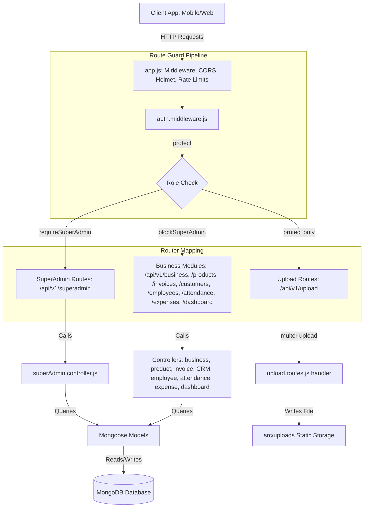
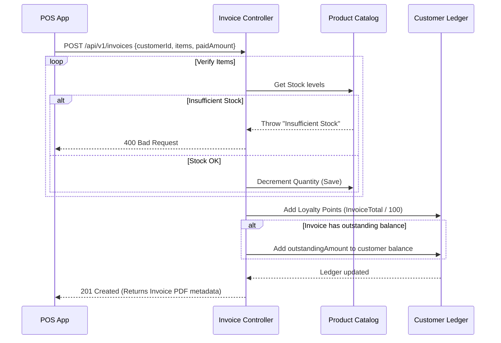
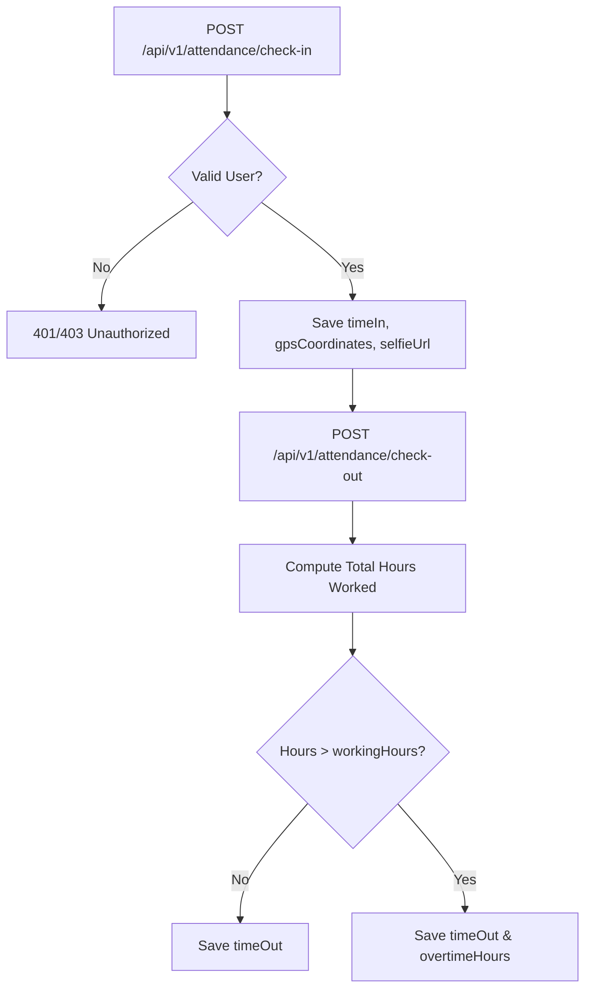
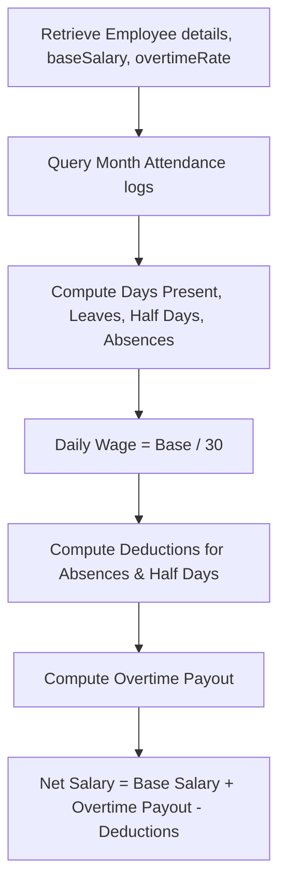

# BizOS — MSME Business Operating System

> **Not just a ledger.** BizOS is an all-in-one Business Operating System built to digitize day-to-day operations for small and medium enterprises (MSMEs). It replaces manual paper logs and spreadsheets by consolidating five core business pillars — **Inventory**, **Billing**, **CRM**, **Employee Attendance**, and **Expenses** — into a single unified application.

[](https://github.com)
[](https://github.com)
[](https://github.com)

---

## 📋 Table of Contents
- [Overview](#-overview)
- [What Makes BizOS Different](#-what-makes-bizos-different)
- [Core Features & Modules](#-core-features--modules)
- [System Architecture](#-system-architecture)
- [Tech Stack](#-tech-stack)
- [Project Directory Structure](#-project-directory-structure)
- [Core Data Pipelines & Lifecycles](#-core-data-pipelines--lifecycles)
- [Environment Variables](#-environment-variables)
- [Installation & Setup](#-installation--setup)
- [Security & Optimization Features](#-security--optimization-features)
- [License](#-license)

---

## 🌟 Overview

BizOS is designed as a centralized platform for small business owners and managers to monitor operations in real-time. By connecting POS billing directly with live inventory and customer ledgers, the platform ensures that every transaction immediately reflects across the business's financial and logistical state.

Additionally, BizOS integrates robust employee shifts and expenses tracking, providing owners with automated monthly payroll sheets and Profit & Loss summaries in one secure space.

---

## What Makes BizOS Different

These are the engineering highlights that separate BizOS from generic spreadsheet applications and basic trackers:

| Feature | Implementation |
|---|---|
| 📦 **Atomic Inventory Allocation** | Automatically decrements stock quantities on invoice checkouts and rolls back transactions or raises alerts if stock drops below reorder thresholds. |
| 🕐 **Geo-location & Selfie Attendance** | Validates daily employee clock-in records using coordinates and selfie image validation to prevent buddy-punching. |
| 💸 **Dynamic Payroll Wages Engine** | Computes monthly employee wages dynamically by evaluating shift records, daily standard wages, and hourly overtime rates. |
| 🔒 **Granular Role-Based Access** | Strict Express route guards verifying roles from SuperAdmin (platform diagnostics) to Employees (attendance logs) and Accountants (financial read-only auditing). |
| ⚡ **Composite Indexing & Routing** | Optimized Mongoose indices (`{ businessId: 1, barcode: 1 }`, `{ businessId: 1, invoiceNumber: 1 }`) to ensure fast barcode lookups and checkout queries under load. |

---

## ✨ Core Features & Modules

### 1. Inventory Management
- **Catalog Tracking**: Manage details, categories, purchase/selling prices, and minimum stock alert levels.
- **Low Stock Alerts**: Automatically highlights products reaching critical stock levels.
- **Barcode Support**: Speeds up checkout registers with indexed barcode scan matches.

### 2. Billing & Invoicing
- **Multi-mode Payments**: Handles payments made in Cash, UPI, Card, or Store Credit.
- **Stock Decoupling**: Seamlessly reduces inventory volumes at checkout.
- **Invoice Records**: Saves history, taxes, discounts, outstanding balances, and returns.

### 3. CRM & Customer Ledger
- **Customer Profiles**: Retains loyalty points and balances.
- **Store Credit Tracker**: Automatically adds unpaid balances to customer ledgers.
- **Loyalty Program**: Grants loyalty points computed dynamically as a percentage of checkout totals.

### 4. Employee Attendance
- **GPS & Selfie Punches**: Enables employees to punch in/out using coordinates and visual check URLs.
- **Overtime Calculations**: Computes overtime hours automatically for shifts running past standard hours.
- **Detailed Attendance Logs**: Retains check-in/out times, statuses, and coordinates.

### 5. Expense Tracking
- **Categorized Claims**: Classify expenses under Rent, Salaries, Utilities, Materials, Transport, or Marketing.
- **Approval Workflow**: Submissions by managers or staff require Admin approvals before reimbursement.
- **Profit & Loss Metrics**: Directly feeds into dashboard metrics for dynamic P&L calculation.

---

## 🏗️ System Architecture



---

## 🛠️ Tech Stack

### Backend
- **Node.js**: Main runtime environment.
- **Express.js**: HTTP REST framework using ES Modules (ESM).
- **MongoDB + Mongoose**: Document database and Object Data Modeling (ODM).
- **JWT (JSON Web Tokens)**: Secure token-based session authentication.
- **Helmet & Rate Limit**: Express security middleware and endpoint rate limits.
- **Bcrypt**: Salted password hashing.

### Frontend
- **React 18**: Dynamic UI client framework.
- **Vite**: High-speed frontend building tool.
- **Vanilla CSS**: Foundational, flexible styling system.

---

## 📁 Project Directory Structure

```text
MSME/
├── backend/                  # Node.js + Express REST API
│   ├── src/
│   │   ├── config/           # Database connection & setup
│   │   ├── controllers/      # Business logic controllers (invoices, inventory, CRM, etc.)
│   │   ├── docs/             # Swagger and internal API documentation
│   │   ├── middlewares/      # Express middlewares (Auth guards, file upload)
│   │   ├── models/           # Mongoose schemas & models (User, Business, Product, etc.)
│   │   ├── routes/           # Express router endpoints
│   │   ├── seed/             # DB seeding scripts for mock data setup
│   │   ├── services/         # Third-party integrations & utilities
│   │   ├── uploads/          # Static file uploads directory
│   │   └── utils/            # Helper classes, error formats, and constants
│   ├── app.js                # Express app setup (cors, helmet, rate limiting)
│   ├── constants.js          # Shared app-wide constants
│   ├── package.json
│   └── .env                  # Environment variables (not committed)
│
├── frontend/                 # React + Vite client application
│   ├── src/
│   │   ├── assets/           # Client-side static assets (icons, brand logos)
│   │   ├── components/       # Shared UI layouts and components (DashboardLayout, etc.)
│   │   ├── context/          # React Context providers (AuthContext, ThemeContext)
│   │   ├── pages/            # View pages (Billing, CRM, Dashboard, Expenses, etc.)
│   │   ├── utils/            # Helper files (sidebar route mappings)
│   │   ├── App.css           # Global stylesheet and premium theme variables
│   │   ├── App.jsx           # Root app with React Router configuration
│   │   ├── index.css         # Foundational CSS reset styles
│   │   └── main.jsx          # React renderer entrypoint
│   ├── index.html
│   └── package.json
│
├── SYSTEM_DESIGN.md          # Architecture, DB schema, and workflow diagrams
└── README.md
```

---

## 🔄 Core Data Pipelines & Lifecycles

### 1. Transaction Billing & Stock Allocation


### 2. Daily Attendance & Selfie Punch-In/Out


### 3. Monthly Payroll Wage Pipeline


---

## 🔑 Environment Variables

Create a `.env` file inside the `backend/` folder:

```env
PORT=5000
MONGO_URI=mongodb://localhost:27017/bizos
JWT_SECRET=your_jwt_secret_here
NODE_ENV=development
```

---

## ⚡ Installation & Setup

### Prerequisites
- **Node.js** v18 or higher
- **MongoDB** — local instance or a MongoDB Atlas connection string

### 1. Configure and Run Backend
```bash
cd backend
npm install
npm run dev
```
The API will start at **`http://localhost:5000`**.  
Health check: `http://localhost:5000/health`

### 2. Configure and Run Frontend
```bash
cd frontend
npm install
npm run dev
```
The Vite development server will start at **`http://localhost:5173`**.

---

## 🧠 Security & Optimization Features

- **Bcrypt Salted Hashing**: Enforces standard cryptographic security for stored passwords via Mongoose pre-save middleware hooks.
- **Strict Endpoint Rate Limiting**: Capping sensitive routes at 100 requests per 15 minutes and standard routes at 300 requests to mitigate DDoS or credential stuffing.
- **Helmet Headers Integration**: Exposes strict script, injection, and frame security controls.
- **Optimized Composite Indexes**: Composite Mongo indexes to accelerate product searches (`{ businessId: 1, barcode: 1 }`) and daily operations logs lookup.

---

## 📜 License

Distributed under the **MIT License**. See `LICENSE` for details.
