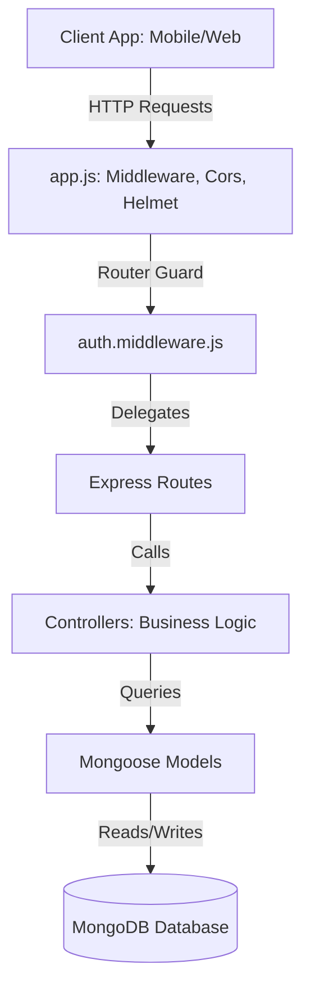
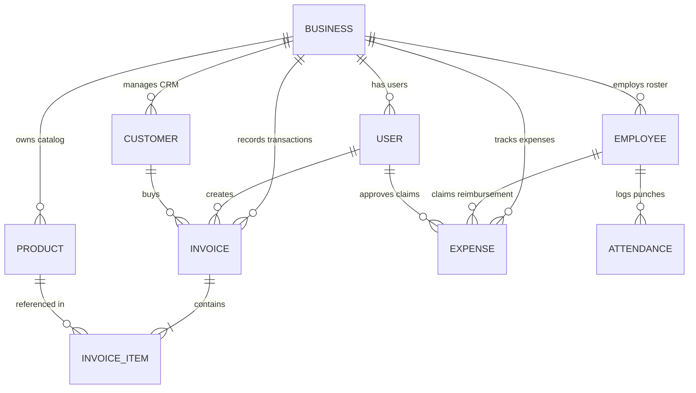
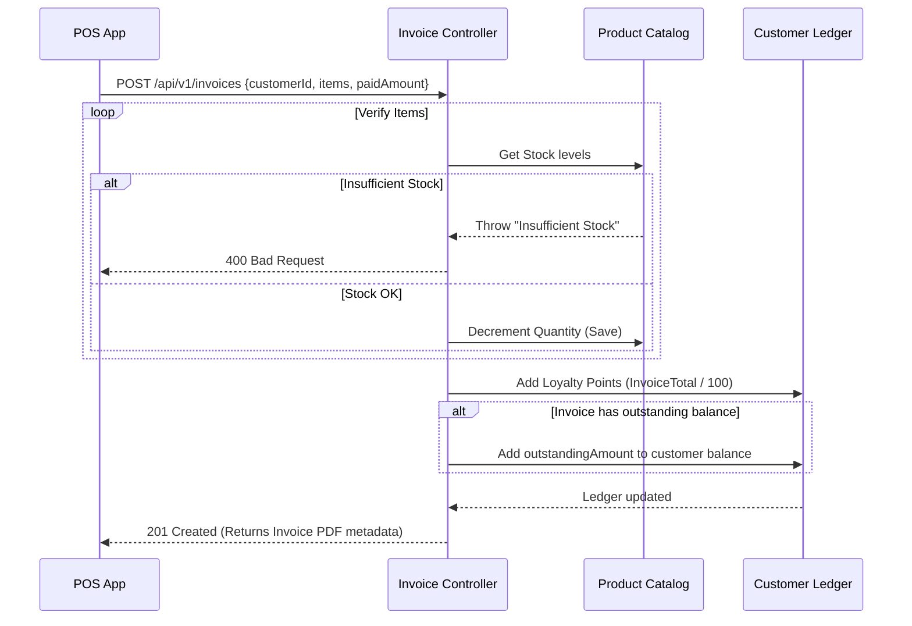

# BizOS - System Design Document

This document outlines the system architecture, database design, and key operational workflows for the **BizOS MSME Business Operating System** backend.

---

## 1. Architectural Overview

BizOS is designed as a monolithic RESTful API built on the **MVC (Model-View-Controller)** pattern. This ensures simplicity, fast deployment, and clean separation of concerns. The backend is modularized to support independent development of the five business operating pillars.

### Key Design Pillars
- **ES Modules (ESM)**: Fully compliant with Node.js ES Modules to make use of standard `import/export` statements for cleaner code import.
- **RESTful Endpoints**: Versioned routing structure (`/api/v1/...`) supporting standard HTTP verbs (`GET`, `POST`, `PUT`, `DELETE`).
- **Security-First Pipeline**: Protects all business operations behind JWT checks and limits request traffic at the router level.

---

## 2. Database Schema & ER Diagram

We use a document-oriented structure in **MongoDB** configured via **Mongoose**. Documents are linked using ObjectIDs, allowing relational-like querying via Mongoose `.populate()`.

### Models Detailed Schema

#### 1. Business
- `_id`: ObjectId
- `name`: String (Required, trimmed)
- `address`: String
- `gstin`: String
- `logo`: String (URL)
- `phone`: String
- `email`: String
- `owner`: ObjectId (Ref -> User)

#### 2. User
- `_id`: ObjectId
- `name`: String (Required)
- `email`: String (Required, unique)
- `password`: String (Required, select: false)
- `role`: String (Enum: `Admin`, `Manager`, `Staff`, `Accountant`)
- `phone`: String
- `businessId`: ObjectId (Ref -> Business)

#### 3. Product (Inventory catalog)
- `_id`: ObjectId
- `name`: String (Required)
- `category`: String (Required)
- `unit`: String (Required, e.g., Kg, Pcs)
- `purchasePrice`: Number (Required)
- `sellingPrice`: Number (Required)
- `stockQuantity`: Number (Default: 0)
- `minStockLevel`: Number (Default: 5)
- `expiryDate`: Date
- `barcode`: String (Indexed)
- `warehouse`: String
- `businessId`: ObjectId (Ref -> Business, Indexed)
- `createdBy`: ObjectId (Ref -> User)

#### 4. Customer (CRM Ledger)
- `_id`: ObjectId
- `name`: String (Required)
- `phone`: String (Required, Indexed)
- `email`: String
- `address`: String
- `gstin`: String
- `tags`: [String] (Default: `["Retail"]`)
- `outstandingBalance`: Number (Default: 0)
- `loyaltyPoints`: Number (Default: 0)
- `businessId`: ObjectId (Ref -> Business, Indexed)
- `createdBy`: ObjectId (Ref -> User)

#### 5. Invoice (Billing details)
- `_id`: ObjectId
- `invoiceNumber`: String (Required, unique per business)
- `customerId`: ObjectId (Ref -> Customer)
- `items`: Array of InvoiceItems:
  - `productId`: ObjectId (Ref -> Product)
  - `name`: String (Cached name)
  - `quantity`: Number
  - `purchasePrice`: Number
  - `sellingPrice`: Number
  - `discount`: Number
  - `taxRate`: Number
  - `taxAmount`: Number
  - `total`: Number
- `subtotal`: Number
- `taxTotal`: Number
- `discountTotal`: Number
- `totalAmount`: Number
- `paymentMode`: String (Enum: `Cash`, `UPI`, `Card`, `Credit`)
- `status`: String (Enum: `Paid`, `Partially Paid`, `Unpaid`, `Returned`)
- `paidAmount`: Number
- `outstandingAmount`: Number
- `dueDate`: Date
- `businessId`: ObjectId (Ref -> Business)
- `createdBy`: ObjectId (Ref -> User)

#### 6. Employee
- `_id`: ObjectId
- `name`: String (Required)
- `role`: String (Required, e.g., Driver, Counter clerk)
- `salaryDetails`:
  - `baseSalary`: Number (Required)
  - `overtimeRate`: Number (Hourly)
  - `workingHours`: Number (Daily default: 8)
- `shiftTimings`:
  - `start`: String (Default: `"09:00"`)
  - `end`: String (Default: `"18:00"`)
- `status`: String (Enum: `Active`, `Inactive`)
- `businessId`: ObjectId (Ref -> Business)

#### 7. Attendance
- `_id`: ObjectId
- `employeeId`: ObjectId (Ref -> Employee)
- `date`: String (YYYY-MM-DD, Unique index per employee/day)
- `status`: String (Enum: `Present`, `Absent`, `Leave`, `Half Day`)
- `timeIn`: String (HH:MM)
- `timeOut`: String (HH:MM)
- `selfieUrl`: String
- `gpsCoordinates`: { `lat`: Number, `lng`: Number }
- `overtimeHours`: Number
- `businessId`: ObjectId (Ref -> Business)

#### 8. Expense
- `_id`: ObjectId
- `category`: String (Enum: `Rent`, `Salaries`, `Utilities`, `Raw Materials`, `Transport`, `Marketing`, `Misc`)
- `amount`: Number (Required)
- `date`: Date (Required)
- `description`: String
- `receiptUrl`: String
- `status`: String (Enum: `Pending`, `Approved`, `Rejected`)
- `employeeId`: ObjectId (Ref -> Employee)
- `approvedBy`: ObjectId (Ref -> User)
- `reimbursementStatus`: String (Enum: `N/A`, `Pending`, `Reimbursed`)
- `businessId`: ObjectId (Ref -> Business)

---

## 3. Key Architectural Flows

### A. Transaction Billing & Stock Allocation
Every time a bill is finalized, the system coordinates inventory state and financial ledgers atomically.

### B. Daily Attendance selfie & GPS punch-in
- Staff punch check-in from their app -> check-in logs longitude/latitude coordinates.
- Punch-out records timestamp, evaluates total duration against Employee standard `workingHours`, and logs decimal `overtimeHours`.

### C. Monthly Payroll Wages Calculation
At month end:
1. Fetch Employee record to obtain `baseSalary`, daily standard wage, and `overtimeRate`.
2. Scan the month's Attendance records for match `YYYY-MM`.
3. Compute summary statistics:
   - Days Present, Leaves, Half Days, and Absences.
4. Calculate net pay:
   $$\text{Daily Wage} = \frac{\text{Base Salary}}{30}$$
   $$\text{Deductions} = (\text{Absent Days} \times \text{Daily Wage}) + (\text{Half Days} \times \text{Daily Wage} \times 0.5)$$
   $$\text{Overtime Payout} = \text{Total Overtime Hours} \times \text{Overtime Rate}$$
   $$\text{Net Salary} = \text{Base Salary} + \text{Overtime Payout} - \text{Deductions}$$

---

## 4. Security & Optimization Features

### Security Controls
- **Bcrypt Hashing**: User passwords are encrypted with salt level 10 before write database commits.
- **Strict Rate Limiting**:
  - Auth Endpoints: Capped at 20 requests per 15 minutes to thwart brute-force login hacks.
  - General API: Capped at 300 requests per 15 minutes.
- **Helmet Headers**: Exposes safe cross-origin resource sharing, framing restrictions, and prevents XSS.
- **Role authorization check**: Endpoint restrictions filter requests:
  - *Admin*: All CRUD resources.
  - *Manager*: Core operations, stock modifications, attendance approvals, expense confirmations.
  - *Staff*: Invoices creation, customer CRM logging, self check-in punch operations.
  - *Accountant*: Financial cash-flow reporting views, GST summaries audits, Employee payroll review.

### Database Indexing Strategy
We implement composite index configurations to ensure fast queries:
- `Product`: `{ businessId: 1, name: 1 }` and `{ businessId: 1, barcode: 1 }` (lowers scan lookups during quick barcode registers).
- `Invoice`: `{ businessId: 1, invoiceNumber: 1 }` (unique per business) and `{ businessId: 1, createdAt: 1 }` (fast chronological queries).
- `Customer`: `{ businessId: 1, phone: 1 }` and `{ businessId: 1, name: 1 }`.
- `Attendance`: `{ employeeId: 1, date: 1 }` (prevents double check-ins).
